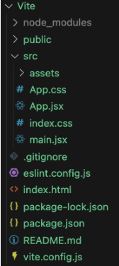
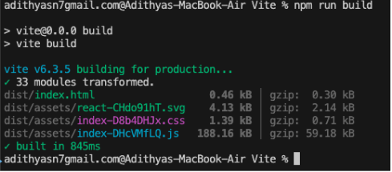
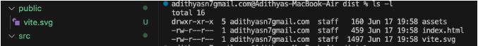
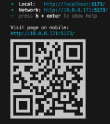

# [Vite Crash Course – Frontend Build Tool](https://www.youtube.com/watch?v=do62-z3z6FM&ab_channel=freeCodeCamp.org)

## Key Notes

- Vite means fast in French.
- Founder of Vite (2019) is Evan, also founder of Vue.js (2014).
- Improves the development and feedback cycle so that we can see changes immediately.
- Provides the initial code required for web development.

## Requirements and Initial Setup

- Node, npm

```bash
npm create vite@latest
npm install && npm run dev
```

The application runs at http://localhost:5173/

## Understanding Folder Structure Created by Vite

- `index.html` – Starting point of the project.
- `src/` – Contains source code and assets.
- `package.json` – Includes all dependencies and npm scripts.
- `vite.config.js` – Vite configuration and list of plugins.



## Experience Fast Development

- Vite uses Hot Module Replacement (HMR).
- Replaces only the part/component that got updated instead of updating the entire application.
- Example: I created a component and placed it in `App.jsx` and it showed instantly.

## Handling Static Assets with Vite

- Vite will hash or optimize the size of images while building. Images should be present in the `src` folder and imported using a relative path.



- All images and files have a hash value at the end and reduced size inside the `dist` folder.
- Files you do not want optimized should be kept in `public` or outside the `src` folder.
- Example: `vite.svg` is placed outside of `src` and in the `dist` folder it does not have the hashed at the end.



## Use Environment Variables in Vite

- Use a `.env` file and all variables should start with `VITE_`.

## Build for Production

- `"build": "vite build"` → `npm run build`
  - Creates a `dist` folder with all required files (some compressed) for production.
- `"preview": "vite preview"` → `npm run preview`
  - Boots up a local static server from the `dist` folder and runs on port 4173.

## How Flexible is Vite – Configuration and Options

- `vite.config.js` contains all configurations.
- You can add additional plugins to the Vite application. Example:
  - Install QR code plugin: `npm install --save-dev vite-plugin-qrcode`
  - Use it in `vite.config.js`.
  - After running `npm run dev`, you will see the plugin in action.



## Why Vite?

- Based on esbuild, rollup.js, and Rolldown (Rust-based), making the application very fast in rendering content.
